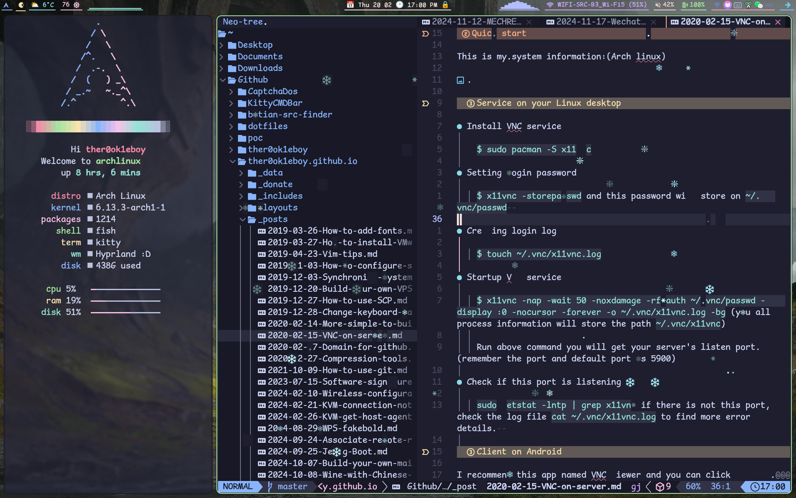
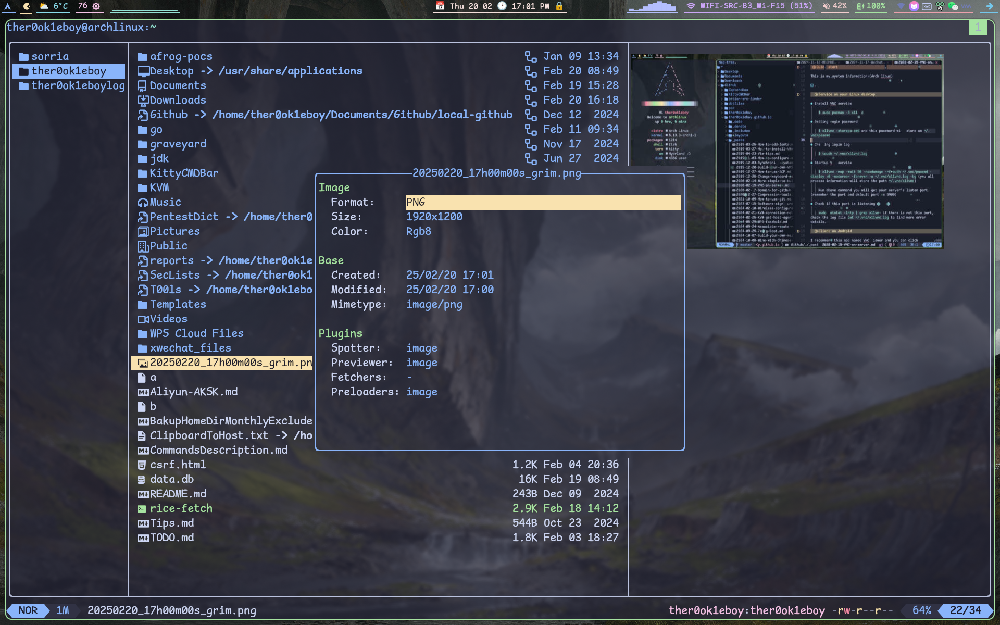
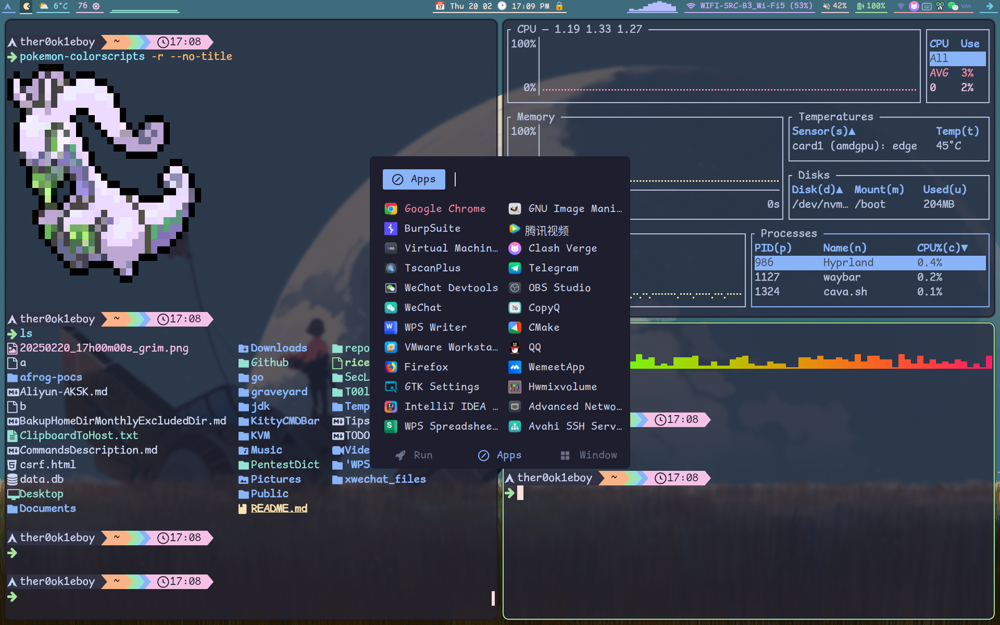
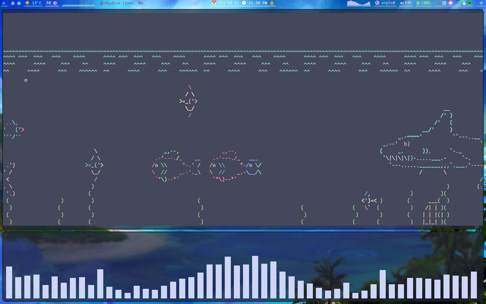
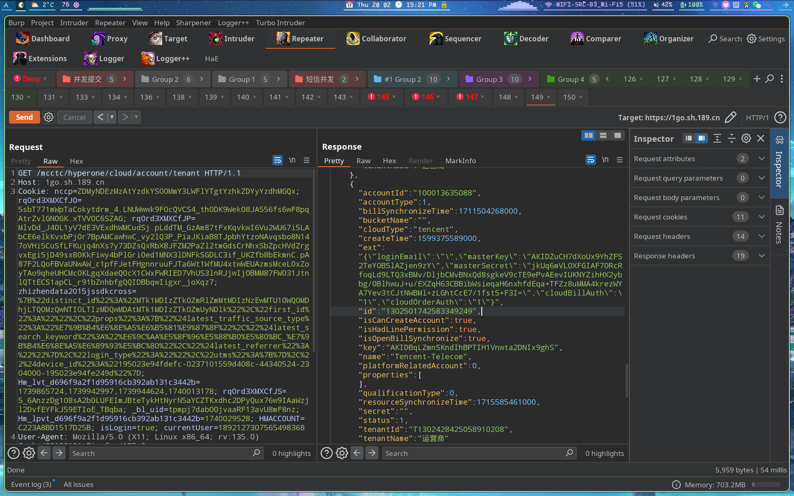

# 🏠 dotfiles

[🇨🇳 中文](README.zh-CN.md) · [🇬🇧 English](README.md)

我的 Arch Linux Wayland 桌面配置，围绕 **Hyprland** 构建，搭配 Catppuccin Mocha 风格、Waybar、Fish、Kitty、Neovim 和 Yazi。✨

> ⚠️ 这是个人使用中的配置集合，不保证开箱即用。安装前请根据自己的硬件、显示器和目录结构调整相关配置。

## 🖼️ Preview

<p align="center">
  
</p>

<table>
  <tr>
    <td></td>
    <td></td>
  </tr>
  <tr>
    <td></td>
    <td></td>
  </tr>
  <tr>
    <td colspan="2"></td>
  </tr>
</table>

## 🍬 Waybar 糖豆人动画

Preview 顶部的 `output.gif` 对应的是 Waybar 自定义模块动画 🎞️，相关脚本和字体资源位于 [`waybar/scripts/pacman.sh-resource`](https://github.com/ther0ok1eboy/dotfiles/tree/master/waybar/scripts/pacman.sh-resource)。

## 🧩 Components

| Component | Directory | Description |
| --- | --- | --- |
| [Hyprland](https://hypr.land/) | `hypr/` | Window manager、窗口规则、输入、快捷键和启动项 |
| [Waybar](https://github.com/Alexays/Waybar) | `waybar/` | 状态栏、天气、媒体控制、Cava 和 Pacman 动画 |
| [Fish](https://fishshell.com/) | `fish/` | Shell 配置、函数、补全和插件 |
| [Kitty](https://sw.kovidgoyal.net/kitty/) | `kitty/` | 终端配置 |
| [Neovim](https://neovim.io/) / [LazyVim](https://www.lazyvim.org/) | `nvim/` | 编辑器配置和插件锁定文件 |
| [Yazi](https://yazi-rs.github.io/) | `yazi/` | 文件管理器、主题和预览脚本 |
| [Fuzzel](https://codeberg.org/dnkl/fuzzel) | `fuzzel/` | Wayland 启动器和剪贴板菜单 |
| [Rofi](https://github.com/davatorium/rofi) | `rofi/` | 应用启动器 |
| [Mako](https://github.com/emersion/mako) | `mako/` | Wayland 通知守护进程 |
| [CopyQ](https://hluk.github.io/CopyQ/) / `cliphist` | `copyq/` | 剪贴板管理 |

## 📁 Repository layout

```text
.
├── copyq/       # CopyQ 配置和数据
├── fish/        # Fish shell 配置、函数、主题和插件
├── fuzzel/      # Fuzzel 配置与 Catppuccin 主题
├── hypr/        # Hyprland 配置、壁纸和启动脚本
├── kitty/       # Kitty 配置
├── mako/        # Mako 通知配置
├── nvim/        # Neovim / LazyVim 配置
├── rofi/        # Rofi 配置与主题
├── waybar/      # Waybar 配置、样式、自定义脚本和动画字体资源
└── yazi/        # Yazi 配置、主题和文件预览脚本
```

## 🚀 Installation

### 1. 📥 Clone

```bash
git clone https://github.com/ther0ok1eboy/dotfiles.git ~/dotfiles
cd ~/dotfiles
```

### 2. 📦 Install dependencies

根据发行版安装对应软件包。常用依赖包括：

```text
hyprland waybar fish kitty neovim yazi rofi fuzzel mako
wl-clipboard cliphist grim slurp swappy
fcitx5 starship cava playerctl jq curl
```

部分脚本还会使用 `awww`、`mpvpaper`、`tesseract`、`bluetoothctl`、`pavucontrol` 和 `nm-applet`，可按需安装。

## ⚠️ Important local settings

安装后建议优先检查以下文件中的机器相关配置 🛠️：

- `hypr/awesomeconf/monitor.lua`：显示器名称、分辨率、刷新率和布局。
- `hypr/awesomeconf/autostart.lua`：登录后自动启动的程序。
- `waybar/scripts/wallpaper*.sh`：壁纸目录为本机路径，需要替换。
- `waybar/scripts/live-wallpaper-engine.sh`：动态壁纸目录需要替换。
- `waybar/scripts/todo-list.sh`：默认读取 `~/Documents/future-plans.md`。
- `waybar/scripts/weather.sh`：天气城市和 API 配置需要替换为自己的设置。
- `fish/config.fish`：代理、输入法和环境变量配置。

不要直接复制其中的个人路径、代理地址或 API 密钥到其他机器。🔒

## ⌨️ Keybindings

默认主修饰键为 `Super`：

| Shortcut | Action |
| --- | --- |
| `Super + Enter` | 打开 Kitty |
| `Super + Space` | 打开 Rofi 应用启动器 |
| `Super + C` | 打开剪贴板历史 |
| `Super + S` | 截图并打开 Swappy |
| `Super + F` | 切换全屏 |
| `Super + O` | 截图识字 |
| `Super + L` | 打开电源菜单 |
| `Super + N` | 打开 Nemo |
| `Super + P` | 关闭当前窗口 |
| `Super + 1..0` | 切换工作区 |
| `Super + Shift + 1..0` | 将当前窗口移动到工作区 |
| `Super + 鼠标左键` | 移动窗口 |
| `Super + 鼠标右键` | 调整窗口大小 |

快捷键定义位于 `hypr/awesomeconf/binds.lua`，可按个人习惯修改。

## 📝 Notes

- 当前配置主要面向 Linux + Wayland + Hyprland。
- Neovim 使用 LazyVim，插件版本记录在 `nvim/lazy-lock.json`。
- 配置中的第三方主题目录保留了各自的上游仓库和许可证文件。
- 修改配置后通常需要重启对应程序；修改 Hyprland 启动项或环境变量后建议重启 Hyprland 会话。

## 📜 License

本仓库主要用于个人配置备份。仓库内第三方主题、插件和资源文件请遵循其各自目录中的许可证。
