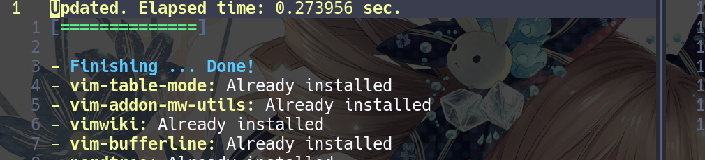
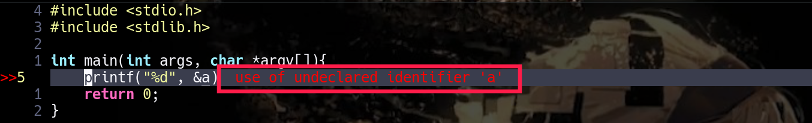

### Introduction

With the growth of Linux user, we can not avoid to not use `vim` and code become a common thing edited by `vim`. So you guess you must bored with `vim` and always ask why `vim` has not code completion. I also believe you have install or try some code completion plugins. Otherwise you will not find this article. Today i will share a powerful and easy-to-use plugin named COC.

> Effect:


### Content

- [ ] What COC plugin

- [ ] Requirements
 
- [ ] Installation
     
     * install neovim
 
     * transfer configuration file
 
     * load plugins
 
- [ ] Add COC plugin
 
     * load some dependences
 
     * add official code lines
 
     * read its key-mapping
 
- [ ] Add language servers
 
     * configure JASON file
 
     * install some language servers
 
     * install code-check tools
 
- [ ] Debug
 
- [ ] Some useful tips
 
- [ ] Q&A

--------


### What COC plugin
Coc is an intellisense engine for Vim/Neovim.True snippet and additional text editing support. Check out [Wiki](https://github.com/neoclide/coc.nvim/wiki) for the vim interface. It support float window, which could convenient to browse your defined functions. Compared with YCM plugin, COC plugin is smaller and easier to install. Most important reason is that COC as a plugin it support add many language plugins like `C/C++` which is support code completion and see more [Wiki](https://github.com/neoclide/coc.nvim/wiki/Using-coc-extensions) to get more details. It has many features like:
- Fast: instant increment completion, increment buffer sync using buffer update events.
- Reliable: typed language, tested with CI.
- Featured: full LSP support
- Flexible: configured like VSCode, extensions work like in VSCode

### Quick Start

### Requirements

`neovim` >= 0.3.1 is required.

`vim` >= 8.0.1453 is required.

Use command `:version` or `$ vim --version` to checkout your vim version.

--------

### Installation

`$ sudo pacman -S neovim`, if you are a neovim user you can ignore it. Beside your all vim configurations and vim-plug will be completely supported by neovim.

`$ nvim file-name` to edit your file. 

Your neovim's local configuration home is `~/.config/nvim` if you have not this directory you can manually add it after your installation. Another thing about neovim is that you will find you have not the neovim's configuration file, so `$ cd ~/.config/nvim && nvim init.vim` and `init.vim` is your neovim's configuration file like `.vimrc`. Only do you is copy your `.vimrc` into `~/.config/nvim` and `mv .vimrc init.vim`. 

When you copy your vim's configuration file into `~/.config/nvim`, you need `PluginInstall` again. If you forget how to install plugins you can see [his github](https://github.com/junegunn/vim-plug) or my following configuration file contents:

```vim
$ nvim ~/.config/nvim/init.vim
# add the following lines into it.
----
if empty(glob('~/.config/nvim/autoload/plug.vim'))
        silent !curl -fLo ~/.config/nvim/autoload/plug.vim --create-dirs
                                \ https://raw.githubusercontent.com/junegunn/vim-plug/master/plug.vim
        autocmd VimEnter * PlugInstall --sync | source $MYVIMRC
endif
----
# it will auto loading Pluginstall manager
```
`$ nvim` you will see that: 



--------

### Add COC plugin

If you not willing to read this article you can refer this [document](https://github.com/neoclide/coc.nvim) which is a official documents having more details.

Install nodejs and pyneovim when necessary:

```vim
curl -sL install-node.now.sh/lts | bash
pip3 install neovim
npm install -g neovim
----
# Install nerd-fonts (actually it’s optional but it looks real good)
```

Add the following line into `init.vim`.

```vim
Plug 'neoclide/coc.nvim', {'branch': 'release'} 
----
# run `:PlugIinstall` to load this plugin. 
```

Some vim plugins could change keymappings. Use a command like :verbose imap <tab> to make sure that your keymap has taken effect. 

Add the following line into `init.vim` again. And do not just copy this lines, you need read some explanations at least

```vim
" if hidden is not set, TextEdit might fail.
set hidden

" Some servers have issues with backup files, see #649
set nobackup
set nowritebackup

" Better display for messages
set cmdheight=2

" You will have bad experience for diagnostic messages when it's default 4000.
set updatetime=300

" don't give |ins-completion-menu| messages.
set shortmess+=c

" always show signcolumns
set signcolumn=yes

" Use tab for trigger completion with characters ahead and navigate.
" Use command ':verbose imap <tab>' to make sure tab is not mapped by other plugin.
inoremap <silent><expr> <TAB>
      \ pumvisible() ? "\<C-n>" :
      \ <SID>check_back_space() ? "\<TAB>" :
      \ coc#refresh()
inoremap <expr><S-TAB> pumvisible() ? "\<C-p>" : "\<C-h>"

function! s:check_back_space() abort
  let col = col('.') - 1
  return !col || getline('.')[col - 1]  =~# '\s'
endfunction

" Use <c-space> to trigger completion.
inoremap <silent><expr> <c-space> coc#refresh()

" Use <cr> to confirm completion, `<C-g>u` means break undo chain at current position.
" Coc only does snippet and additional edit on confirm.
inoremap <expr> <cr> pumvisible() ? "\<C-y>" : "\<C-g>u\<CR>"
" Or use `complete_info` if your vim support it, like:
" inoremap <expr> <cr> complete_info()["selected"] != "-1" ? "\<C-y>" : "\<C-g>u\<CR>"

" Use `[g` and `]g` to navigate diagnostics
nmap <silent> [g <Plug>(coc-diagnostic-prev)
nmap <silent> ]g <Plug>(coc-diagnostic-next)

" Remap keys for gotos
nmap <silent> gd <Plug>(coc-definition)
nmap <silent> gy <Plug>(coc-type-definition)
nmap <silent> gi <Plug>(coc-implementation)
nmap <silent> gr <Plug>(coc-references)

" Use K to show documentation in preview window
nnoremap <silent> K :call <SID>show_documentation()<CR>

function! s:show_documentation()
  if (index(['vim','help'], &filetype) >= 0)
    execute 'h '.expand('<cword>')
  else
    call CocAction('doHover')
  endif
endfunction

" Highlight symbol under cursor on CursorHold
autocmd CursorHold * silent call CocActionAsync('highlight')

" Remap for rename current word
nmap <leader>rn <Plug>(coc-rename)

" Remap for format selected region
xmap <leader>f  <Plug>(coc-format-selected)
nmap <leader>f  <Plug>(coc-format-selected)

augroup mygroup
  autocmd!
  " Setup formatexpr specified filetype(s).
  autocmd FileType typescript,json setl formatexpr=CocAction('formatSelected')
  " Update signature help on jump placeholder
  autocmd User CocJumpPlaceholder call CocActionAsync('showSignatureHelp')
augroup end

" Remap for do codeAction of selected region, ex: `<leader>aap` for current paragraph
xmap <leader>a  <Plug>(coc-codeaction-selected)
nmap <leader>a  <Plug>(coc-codeaction-selected)

" Remap for do codeAction of current line
nmap <leader>ac  <Plug>(coc-codeaction)
" Fix autofix problem of current line
nmap <leader>qf  <Plug>(coc-fix-current)

" Create mappings for function text object, requires document symbols feature of languageserver.
xmap if <Plug>(coc-funcobj-i)
xmap af <Plug>(coc-funcobj-a)
omap if <Plug>(coc-funcobj-i)
omap af <Plug>(coc-funcobj-a)

" Use <TAB> for select selections ranges, needs server support, like: coc-tsserver, coc-python
nmap <silent> <TAB> <Plug>(coc-range-select)
xmap <silent> <TAB> <Plug>(coc-range-select)

" Use `:Format` to format current buffer
command! -nargs=0 Format :call CocAction('format')

" Use `:Fold` to fold current buffer
command! -nargs=? Fold :call     CocAction('fold', <f-args>)

" use `:OR` for organize import of current buffer
command! -nargs=0 OR   :call     CocAction('runCommand', 'editor.action.organizeImport')

" Add status line support, for integration with other plugin, checkout `:h coc-status`
set statusline^=%{coc#status()}%{get(b:,'coc_current_function','')}

" Using CocList
" Show all diagnostics
nnoremap <silent> <space>a  :<C-u>CocList diagnostics<cr>
" Manage extensions
nnoremap <silent> <space>e  :<C-u>CocList extensions<cr>
" Show commands
nnoremap <silent> <space>c  :<C-u>CocList commands<cr>
" Find symbol of current document
nnoremap <silent> <space>o  :<C-u>CocList outline<cr>
" Search workspace symbols
nnoremap <silent> <space>s  :<C-u>CocList -I symbols<cr>
" Do default action for next item.
nnoremap <silent> <space>j  :<C-u>CocNext<CR>
" Do default action for previous item.
nnoremap <silent> <space>k  :<C-u>CocPrev<CR>
" Resume latest coc list
nnoremap <silent> <space>p  :<C-u>CocListResume<CR>
```
**After do that you still have not the function of code completion**

--------

### Add language servers

You can see [its official document](https://github.com/neoclide/coc.nvim/wiki/Language-servers) to get more information.

`$ nvim ~/.config/nvim/coc-settings.json` and add the following line into it:(if you can `:CocConfig` add this lines too).

```json
{
	"yank.enableCompletion" : false,
	"diagnostic.virtualText": true,
	"codeLens.enable": true,
	"suggest.detailMaxLength": 60,
	"languageserver": {
		"lua": {
			"command": "lua-lsp",
			"filetypes": ["lua"]
		},
		"golang": {
			"command": "gopls",
			"rootPatterns": ["go.mod"],
			"filetypes": ["go"]
		},
		"bash": {
			"command": "bash-language-server",
			"args": ["start"],
			"filetypes": ["sh"],
			"ignoredRootPaths": []
		},
		"ccls": {
      "command": "ccls",
      "filetypes": ["c", "cpp", "cuda", "objc", "objcpp"],
      "rootPatterns": [".ccls-root", "compile_commands.json"],
      "initializationOptions": {
         "cache": {
           "directory": ".ccls-cache"
         }
       }
    }
	}
}
```

Run `:CocInstall coc-pyls coc-json coc-html coc-css ` to add needed language servers

```vim
coc-json for json.
coc-tsserver for javascript and typescript.
coc-html for html, handlebars and razor.
coc-css for css, scss and less.
coc-ember for ember projects.
coc-vetur for vue, use vetur.
coc-phpls for php, use intelephense-docs.
coc-java for java, use eclipse.jdt.ls.
coc-solargraph for ruby, use solargraph.
coc-rls for rust, use Rust Language Server
coc-rust-analyzer for rust, use rust-analyzer
coc-r-lsp for r, use R languageserver.
coc-yaml for yaml
coc-python for python, extension forked from vscode-python.
coc-highlight provides default document symbol highlighting and color support.
coc-emmet provides emmet suggestions in completion list.
coc-snippets provides snippets solution.
coc-lists provides some basic lists like fzf.vim.
coc-git provides git integration.
coc-yank provides yank highlights & history.
coc-fsharp for fsharp.
coc-svg for svg.
coc-tailwindcss for tailwindcss.
coc-angular for angular.
coc-vimlsp for viml.
coc-xml for xml, use lsp4xml.
coc-elixir for elixir, based on elixir-ls.
coc-erlang_ls for erlang, based on erlang_ls
coc-tabnine for tabnine.
coc-powershell for PowerShellEditorService integration.
coc-omnisharp for csharp and visualbasic.
coc-texlab for LaTex using TexLab.
coc-lsp-wl for wolfram mathematica, fork of vscode-lsp-wl.
coc-flow for flow
coc-reason for reasonml
coc-svelte for svelte
coc-flutter for flutter
coc-pyright Pyright extension
coc-markdownlint for markdown linting
coc-ecdict ECDICT extension
coc-metals for Scala using Metals
coc-explorer file explorer extension
coc-calc expression calculation extension
```

`$ sudo pacman -S ccls-git` the code completion of C/C++ need its support(it is very importance!). And see [its official document](https://github.com/MaskRay/ccls/wiki/Build) to see more detail

--------

### Debug

Run `:checkhealth` in neovim to error information and follow its tips to modify some lost dependences.

Run `:message` in neovim to find latest error logs.

If you have installed another code comletion plugins, i advise you delete all of them becuase i once installed a code comletion plugin named `YouCompleteMe` but i fail to configure it. When i delete all of its files my plugin just returned to normal.

--------

### Some useful tips

Do `$ pip3 install flake8` for coding check like that:
    


Run `$ sudo pacman -S ctags` for function/class/variable list. When your define your function at `C/C++` you can see some function/class/variale list, which is so comvironent.

--------

### Q&A

>Q:ccls server wont start, exits with code null.

>A:you can refer this [solution](https://github.com/neoclide/coc.nvim/issues/676), i hope it can help you.
