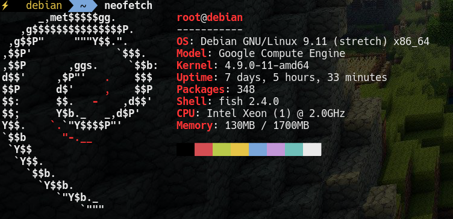
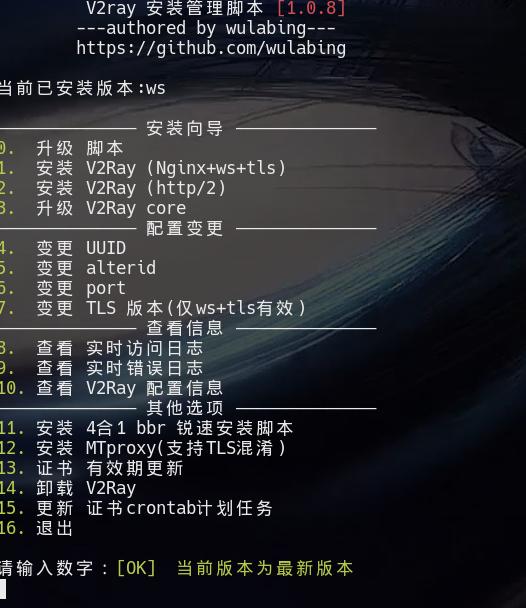
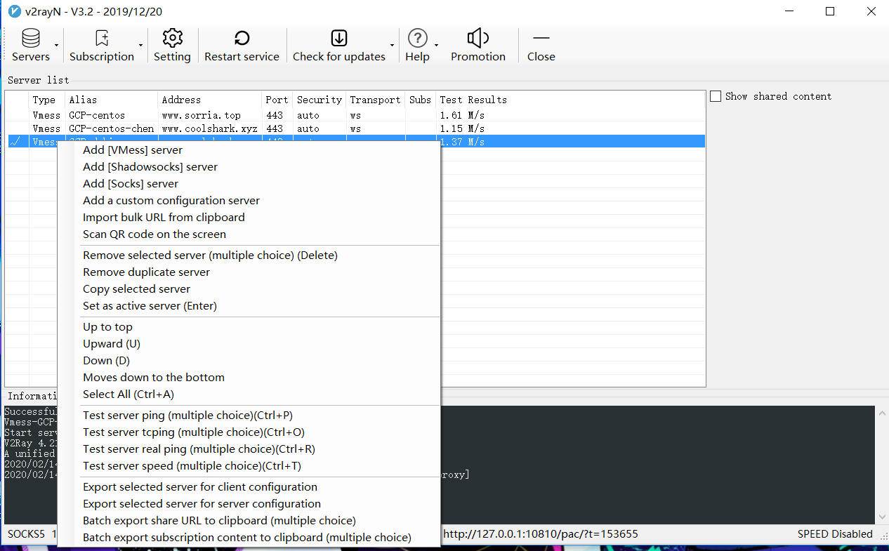
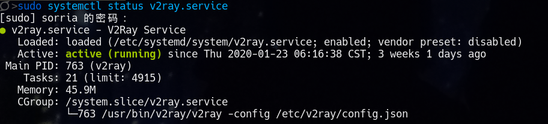
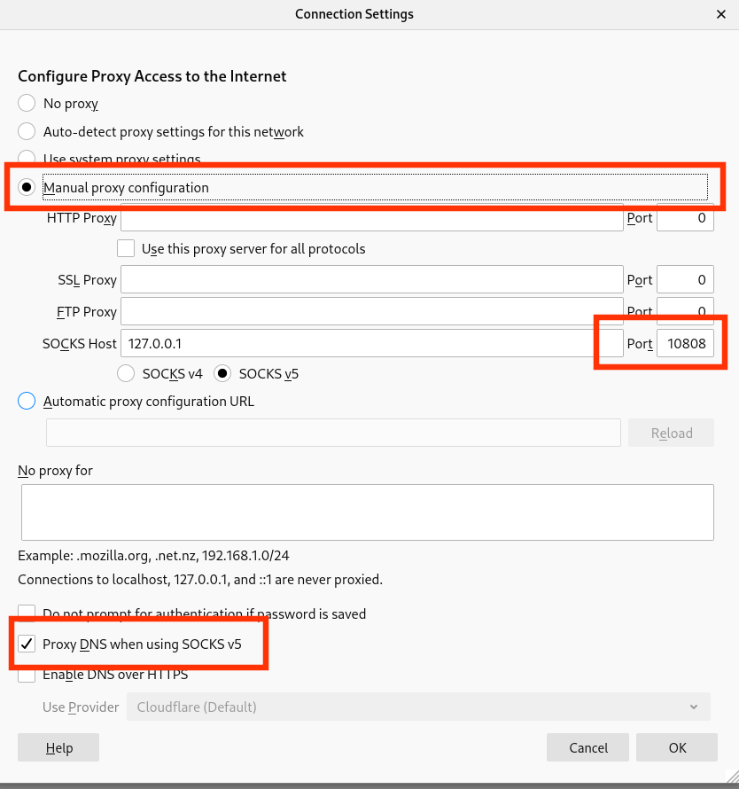

### Introduction:

In this article i will focused introduce how to configure V2rayG client on Linux.   

You may seen my this [article](https://jasonsorria.github.io/2019/12/scure-surfing/) to learn how to use tls and ws to comfortably surfing. And you may think what hell are you writing...OK, it's my error. So today i will share a very very very simple way to tell you how to comfortably surfing.

### Some preparations:

**You must have a VPS and domain(have bond your VPS's IP).**

**My VPS server information.** 



### Quick start:

**Load script(the following oprerations are base on your VPS server)**

Login your VPS server and input`bash <(curl -L -s https://raw.githubusercontent.com/wulabing/V2Ray_ws-tls_bash_onekey/master/install.sh) | tee v2ray_ins.log` and input 1.

 

In this process, you also need correctly input your domain.

After execute this script you will get a QR code. If your v2rayG's version is Windows, scan this QR code(if you do not know how to install v2rayG on Windows you can see this [article](https://jasonsorria.github.io/2019/12/scure-surfing/).)

**Startup BBR** 

`yum install wget && wget --no-check-certificate https://github.com/teddysun/across/raw/master/bbr.sh && chmod +x bbr.sh && ./bbr.sh` 

**Check your pretend website**

Open your browser and input your domain [www.your-domain.com](https://sorria-linux.club/), this script has helped you to apply for SSL and auto install Ngnix so you can see your websit.

**Config V2rayG client on Windows**

In last article i have written how to configure it.

**Config V2rayG on Linux(the following oprerations are base on your v2ray client)**

- **1): open [https://install.direct/go.sh](https://install.direct/go.sh) and copy its contents to a file named `go.sh`** 

- **2): open [https://github.com/v2ray/v2ray-core/releases](https://github.com/v2ray/v2ray-core/releases) and download `v2ray-linux-64.zip`**

- **3): make `go.sh` and `v2ray-linux-64.zip` under the a directory(such as `cp go.sh v2ray-linux.zip Dir && cd Dir`)**

- **4): `sudo bash go.sh --local ./v2ray-linux-64.zip` and check v2ray's status `sudo systemctl status v2ray`**

- **5): get confiuration file**

    - open your Windows client and Export selected server for client configuration and rename it `config.json` 


        

    -  `cd /etc/v2ray` using this new `config.json` to replace the old `config.json`   

    - check status `sudo systemctl status v2ray` 

        

- **6): But you still can not comfortably surfing such as [Google](https://www.google.com/)(the followings are three ways to usage v2ray)**   


    - Firefox:

        

        the Port is your v2ray Lisent port(if you do not know your port`sudo netstat -pantu | grep v2ray`).

    - Googel Chrome(due to it has not agent setting it should install an extension named: SwitchOmega)

        https://github.com/FelisCatus/SwitchyOmega/releases and how to configure SwitchyOmega you can see this [article](http://www.modys.top/ubuntu-configuration-google-browser-shadowsocks-proxy-online.html) to get more detail.    

    - proxychains:

        `$ sudo pacman -S proxychains`
    
        `vim /etc/proxychains.conf` add one line `socks5 127.0.0.1 [port]` information in the bottom    

        such as:

        ```shell
        [ProxyList]
        # add proxy here ...
        # meanwile
        # defaults set to "tor"
        #socks4 	127.0.0.1 9050
        socks5 	127.0.0.1 10808
        ```
        usage: `proxychains [your application]`, such as: `proxychains ping www.google.com` 
