## Today, i will share how to comfortably surfing by build GCP+V2ray+WebSocks+tls.

## It is sounds difficult, but it is real complex, please pay a attention to following me.

## Content:

#### 1. You should have a abroad server, i recommend [Google Cloud Platform](https://cloud.google.com/)

#### 2. You need a international domain,you can buy one easy and cheap
 
#### 3. Analysis your domain to your VPS and add CDN and DNSSEC

#### 4. Product verification

#### 5. Add TXT record for your VPS

#### 6. Output configuration file

## Before start do it, i want to suggest that it may take long time to do it, so i will you can insist to end.

## Let us start.

#

### 1. You should have a abroad server, i recommend [Google Cloud Platform](https://cloud.google.com/).

--------

--------

**The reasons why i recommand this platform are is that it will give you one year and $300 to use its server for free only need a Visa Card. i believe your all partners who may exist a person has Visa Card. unfortunately, i only recommand [Vultr](http://bwg.yiqimaila.com/vt/).**

**Configure your VPS:**

- **Creat a new one.**

- **Recommand Los Angeles, memory > 1G, CentOS 7.**

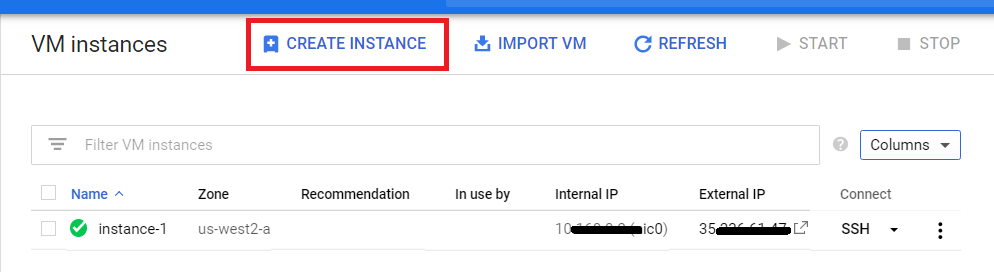 

- **Opent your server firewall and cloud safe group(if you feel trouble you can close firewall), open 22, 80, 443.** 

    `$ sudo -i` 

    `$ passwd`

    `vim /etc/ssh/sshd_conf` set allow root to login to yes  

    `$ systemctl start firewall.service` 

    `$ firewall-cmd --zone=public --parmanent --add-port=443/tcp`

    `$ systemctl restart firewall.service`    

- **After complete, you can use Xshell to login**   

- **You also see [his blog](https://blog.csdn.net/sxt_zls/article/details/89449843) to get more details**

#

### 2. You need a international domain,you can buy one at [namesilo](https://www.namesilo.com/account_home.php).

--------

--------

**Regester a domain and this site it support AliPay, so it is very nice.**

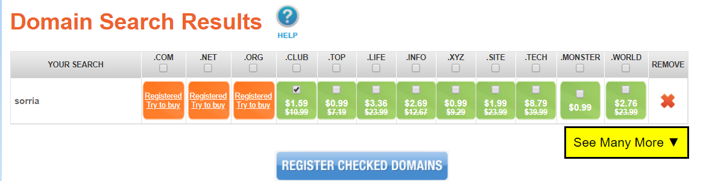 

**Into the interface of Manage Your Domain.** 

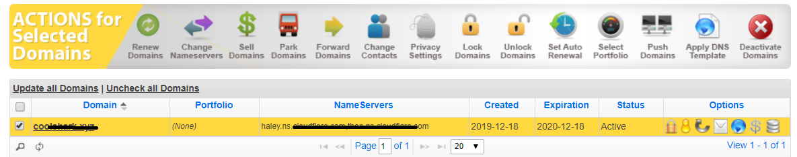 

#

### 3. Analysis your domain to your VPS and add CDN and DNSSEC.

--------

--------

**Go to [Cloudflare](https://dash.cloudflare.com/430bb5774e5536405074533cfde78dad/add-site) to analysis your domain for free(you may get trouble like this, do not worried and wait a while).**

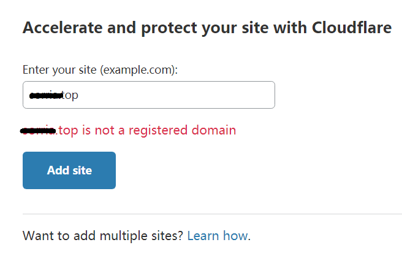

**The first domain has been analysised but the secend one is not complete, so wait a while.**

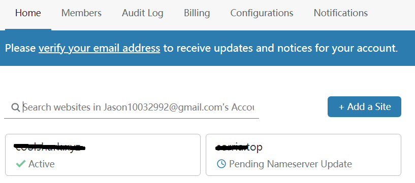 

**Add A record for your server.**

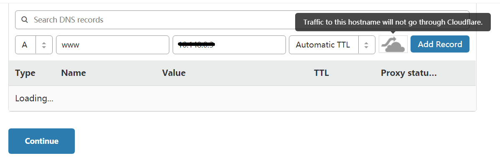

**In Cloudflare web page, using following two DNS servers to Namesilo web page.**

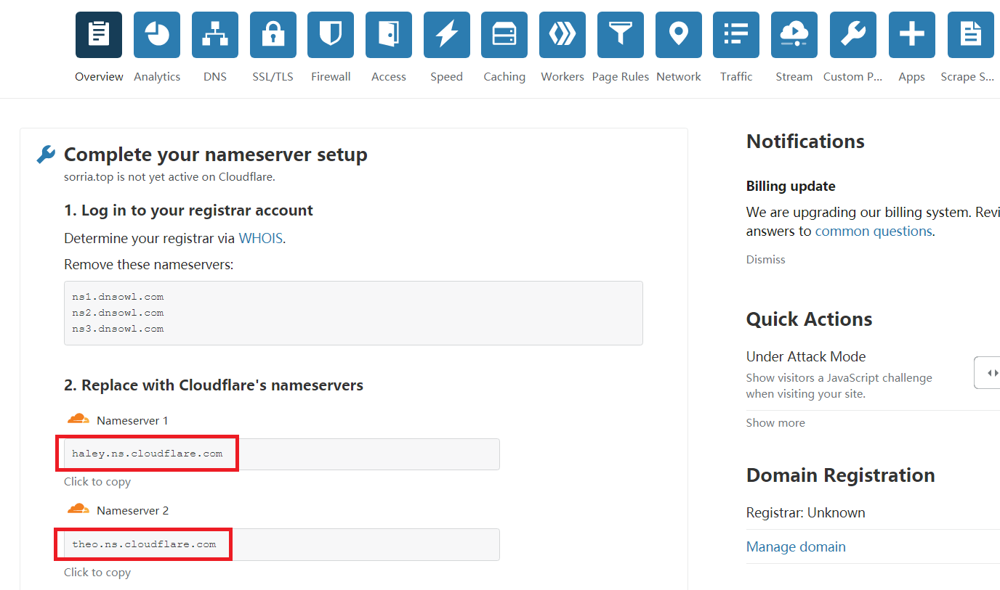

**In Namesilo web page, into interface of Change Nameservers.** 

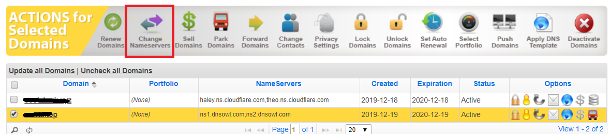

**Change nameservers.**

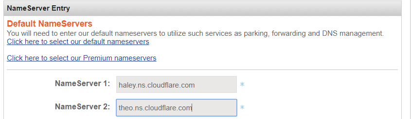

**In Cloudflare web page, into interface of DNS.** 

**In Cloudflare web page, find DBSSEC and add its information to Namesilo web page.**

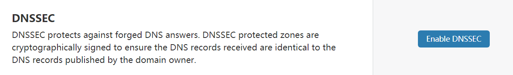

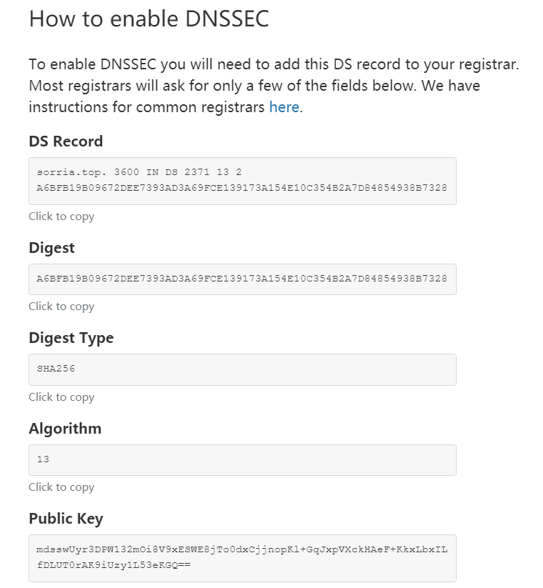

**In Namesilo, find DS Records and add some DNSSEC information.**

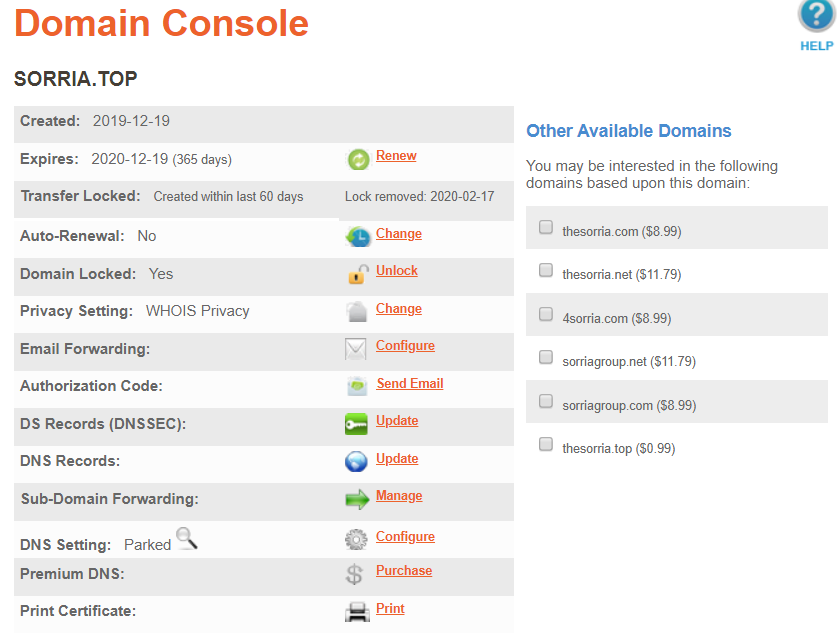

**Match information.**

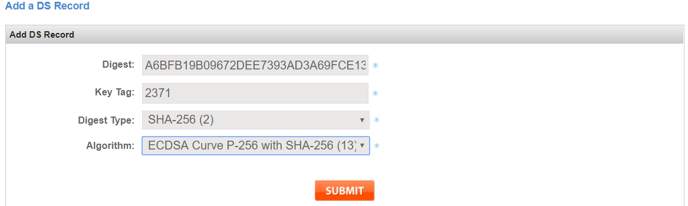

#

### 4. Product verification.

--------
--------

**Use [FreeSSL](https://freessl.cn/) to product verification for free.**

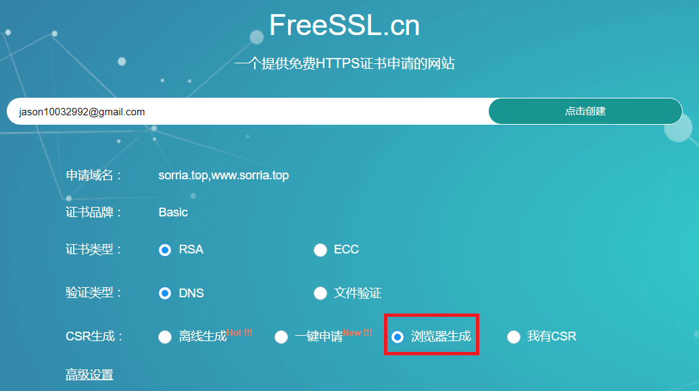

#

### 5. Add TXT record for your VPS.

--------

--------

**Add a TXT record at Cloudflare web page using this information.**

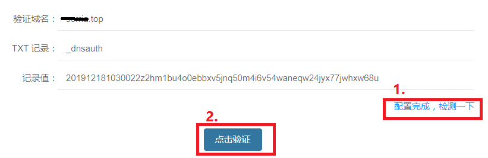

- **After add this information, first to click 1 to check, if the results are similar as following picture(at least two matchs), you can click 2 to continue.**

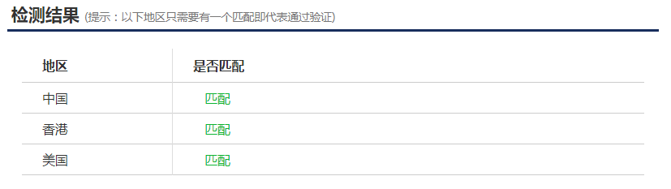

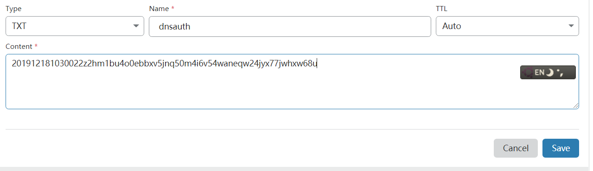

- **if your steps era right, you will get something are similar as the following picture.**

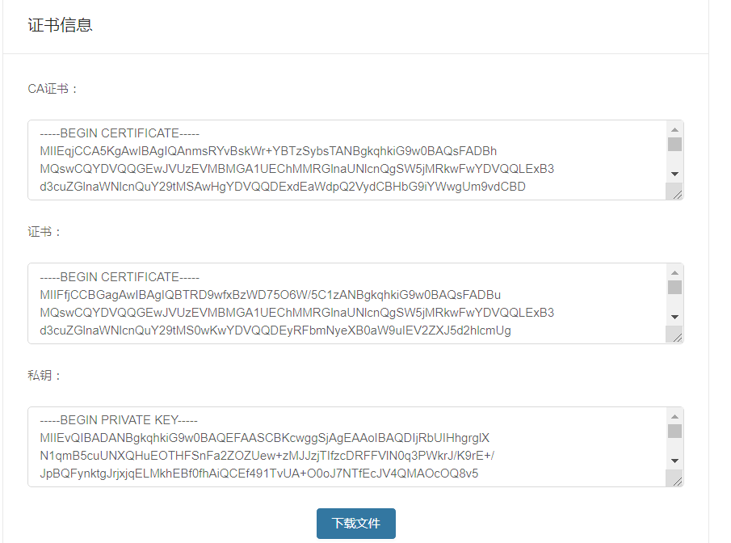

**Copy the conents of your private key into a txt file and rename it to your-domain.key.(such as xxoo.key)**

**Copy the conents of your CA into a txt file and rename it to your-domain.pem.(xxoo.pem)**

**The two file are your veritification end private key.**

### 6. Output configuration file.

**Use this [tool](https://v2.ziyls.com/) to auto product json file.**

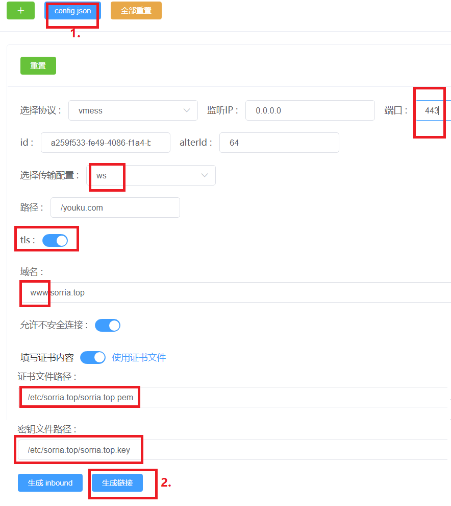

**Click 1 to product JSON file and click 2 to product QR code**

**If you still follow me to there, you will get a JSON file that is V2ray needs, a KEY file and a PEM file.**

### 7. Test with V2ray.

**Configure it again.**

`su root`

- **Startup BBR.**

```shell
echo "net.core.default_qdisc=fq" >> /etc/sysctl.conf
echo "net.ipv4.tcp_congestion_control=bbr" >> /etc/sysctl.conf
sysctl -p
sysctl net.ipv4.tcp_available_congestion_control
lsmod | grep bbr
```
- **Install V2ray.**

`bash <(curl -L -s https://install.direct/go.sh)` 

- **Create directory.**

`mkdir /etc/your-domain` such as /etc/xxoo.com

- **Copy json file to `/etc/v2ray` and copy KEY file and PEM file to `/etc/your-domain/`.**

- **Startup V2ray.**

`systemctl restart v2ray.service` 

**Install V2ray under Window10.**

- **Download [V2ray-windows-64.zip](https://github.com/v2ray/v2ray-core/releases) and [V2rayN.zip](https://github.com/2dust/v2rayN/releases).**

- **Unzip the V2rayN.zip and you will get V2rayN.exe which you should put it to the directory of V2ray-windows-64.**

- **Startup your V2ray and configure it, this domain is your pretend address for which i recommand you add a vedio address because your VPS should run always.**

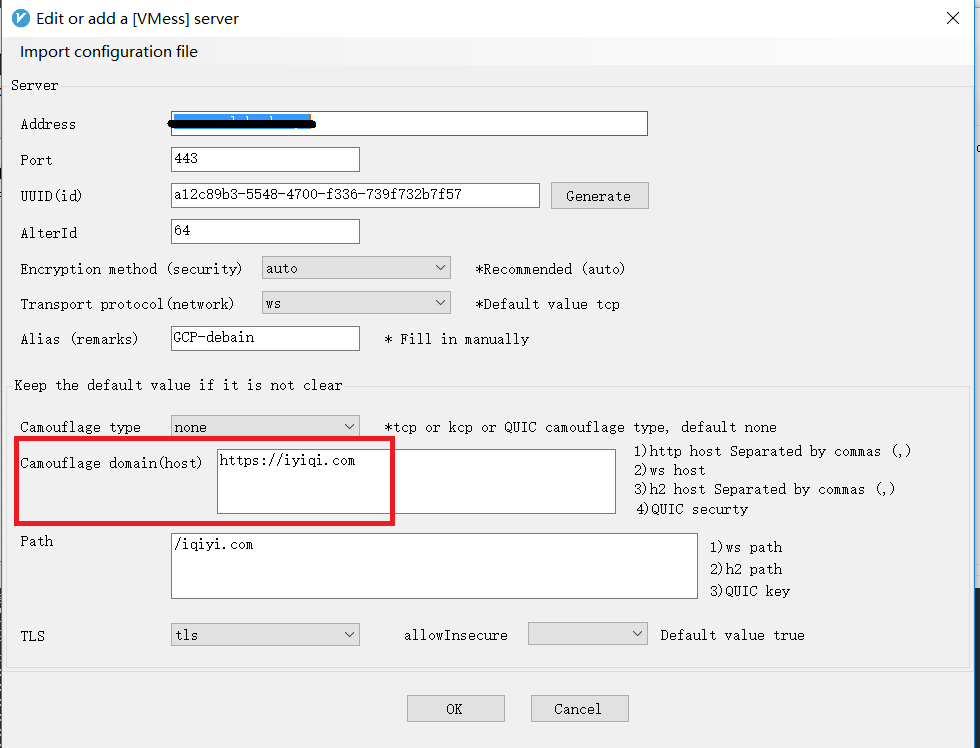

**Install V2ray under Linux.**

- **test speed**

```shell
$ wget https://raw.github.com/sivel/speedtest-cli/master/speedtest.py
$ chmod a+rx speedtest.py
$ mv speedtest.py /usr/local/bin/speedtest
$ chown root:root /usr/local/bin/speedtest
$ speedtest
```


### If you have any problems, you can contact with me and send it to me.

--------------------------------------------------------------- coolshark@sorria-linux.club --------------------------------------------------

--------------------------------------------------------------- jason10032992@gmail.com -------------------------------------------------

