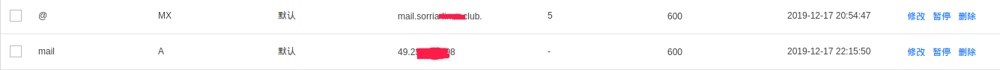
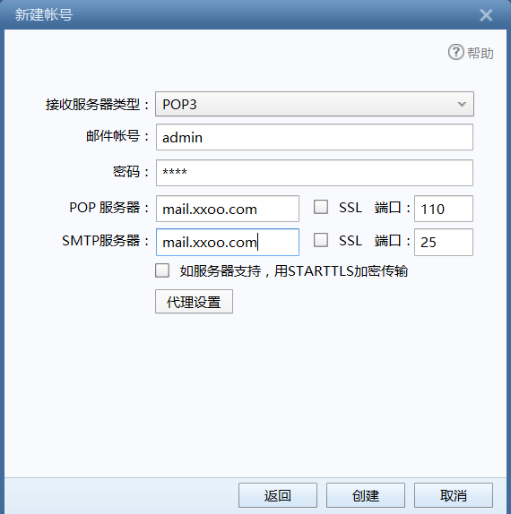

## Today, i will share how to build your own mail-server by postfix and devecot under CentOS 7.

### First and foremost, some tips you must know:

- **SMTP(Simple Mail Transfer Protocol): used to send mail, port:25** 

- **POP3(Post Office Protocol 3): used to store the mails you received in your local server, port: 110** 

- **IMAP(Internet Message Access Protocol 4): used to get mails form your local server, port: 143** 

- **postfix: provide the send mail service** 

- **devecat: provide the receive service**

- **MUA(Mail User Agency): a kind of software that used to send or receive mail(outlook、thunderbird、Mac Mail、mutt)** 

- **MTA(Mali Transmission Agency): a kind of mail-server used to transmit mail(sendmail、postfix)** 

- **MDA(Mail Delivery Agent): as a intermediary betwen MUA and MTA used to filter junk mail(procmail、dropmail)** 

- **MRA(Mail Receive Agent): interact with MUA used to realise protocol of IMAP and POP3(devecot)** 

- **process: MUA -> MTA -> MTA -> ... -> MDA -> MTA -> MRA -> MUA**

### Test local environment:

**check your local firewall and cloud server's safe groups:**

**you should open ports: 25, 110, 143 (if you have used SSL, you also should open 465, 995, 993).**

**into you cloud server's console to add two records:**

    @   MX   mail.your-domain                 //such as @ MX mail.xxoo.com

    mail A   your-ip                          //such as mail A  1.1.1.1




**remove sendmail `$ yum remove sendmail` .**

**modify hostname `$ hostnamectl set-hostname mail.xxoo.club` .**

**modify MTA(the default mail transmission agency):**

`alternatives --config mta ` press Enter to default choose

**check it:**

`alternatives --config mta ` if show `mat - status is manual` that OK     

### Install postfix and configure:

**install postfix and configure it:**

`$ yum install postfix`

```shell
vim /etc/postfix/main.cf

# line 75: clear annotaton, set hostname 
myhostname = mail.xxoo.com 
# line 83: clear annotaton, set domain 
mydomain = xxoo.com 
# line 99: clear annotaton 
myorigin = $mydomain 
# line 116: default is localhost, we should modify to all
inet_interfaces = all 
# line 119: recommand ipv4, if support ipv6, you can set all 
inet_protocols = ipv4 
# line 164: add 
mydestination = $myhostname, localhost.$mydomain, localhost, $mydomain 
# line 264:clear annotaton, set the range of inner network 
mynetworks = 127.0.0.0/8
# line 419: clear annotaton, set the mail store directory
 home_mailbox = Maildir/ 
# line 571: add
smtpd_banner = $myhostname ESMTP 

# add to tail 
# set the max size of mail 10M 
message_size_limit = 10485760 
# set the capacity of mail 1G 
mailbox_size_limit = 1073741824 
# SMTP authority 
smtpd_sasl_type = dovecot 
smtpd_sasl_path = private/auth 
smtpd_sasl_auth_enable = yes
smtpd_sasl_security_options = noanonymous 
smtpd_sasl_local_domain = $myhostname 
smtpd_recipient_restrictions = permit_mynetworks,permit_auth_destination,permit_sasl_authenticated,reject 
```
**set auto startup when you system startup:** 

`$ systemctl  restart  postfix` 

`$ systemctl  enable  postfix`

### Install devecot and configure:

**install devecot and configure it:**

`$ yum install devecot` 

```shell
vim /etc/dovecot/dovecot.conf 

# line 26: if no use IPv6, please modify it to *  
listen = *
# line 48: set the vistor who can use your mail server to send or receive mail, if you want to open it for all person, you can no modify this 
login_trusted_networks = 192.168.10.0/24
--------

vim /etc/dovecot/conf.d/10-auth.conf 

# line 9: clear annotation and add 
disable_plaintext_auth = no 
# line 97: add 
auth_mechanisms = plain login 
--------

vim /etc/dovecot/conf.d/10-mail.conf

# line 30: clear annotation and add 
mail_location = maildir:~/Maildir
--------

vim /etc/dovecot/conf.d/10-master.conf

# line 88-90: clear annotation and add Postfix smtp verification
unix_listener /var/spool/postfix/private/auth { 
mode = 0666 
user = postfix
group = postfix
}
--------

#if you no use SSL, you should do followings
vim /etc/dovecot/conf.d/10-ssl.conf 

# line 8: set the value of ssl to 
ssl = no
```
    
### Test and check:

**mail user is a part of system user, so create a user and set password**

`$ useradd admain` 

`$ passwd admin` 

**use telnet to check the port 110**

`$ telnet 127.0.0.1 110` 

**use Foxmail to login** 

    the mail user is admin you just creat

    pop server is mail.xxoo.com that you add record at your cloud server

    smtp server is mail.xxoo.com



**if you want to use it to receive mail, the receiver is admin@xxoo.com**

### Some problem:

**go to `/var/log/maillog` to see our mail journalists and error logs.**

**why we only receive mail but no send mail because if you use the Ali cloud server or Tensent cloud server, they have block the port 25 in order to prevent you unorderly send junk mail. so, if you server is abroad machine, all functions are normal.**

**if we send mail by our mail-server to other person, but he is not receive the mail, he should see her junk mail.**

#### refer to the blogs:
[https://blog.csdn.net/weixin_36171533/article/details/84877769](https://blog.csdn.net/weixin_36171533/article/details/84877769)

[http://blog.sina.com.cn/s/blog_af19951a0102yz1j.html](http://blog.sina.com.cn/s/blog_af19951a0102yz1j.html)

[https://www.cnblogs.com/operationhome/p/9056870.html](https://www.cnblogs.com/operationhome/p/9056870.html)

### License

**SCTU**

