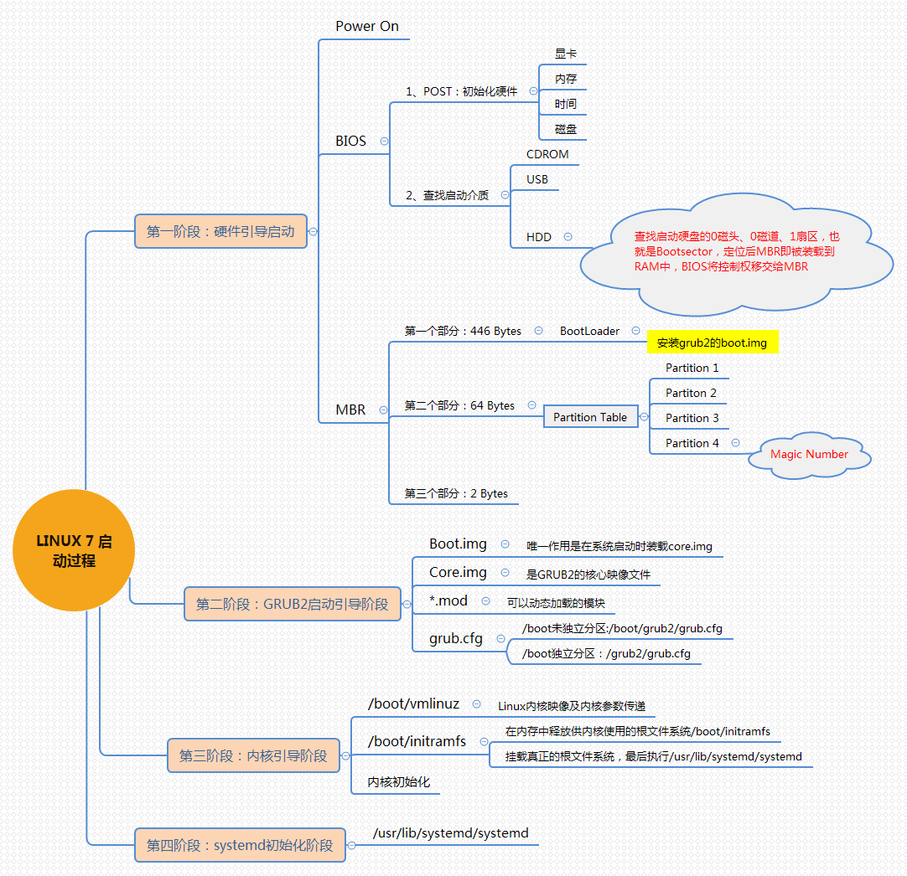

### bios finds mbr

### access into grub interface to choose startup kernel

### read the kernel file: /boot/vmlinuz-*

### read the init's imagination file: /boot/initrd-*

### init he reads /etc/initab

### default runlevel:

- **0 - halt(do not set initdafault to this)** 

- **1 - singal user mode** 

- **2 - multiuser, without NFS(the same as 3, if you don't have networking)** 

- **3 - full multiuser mode** 

- **4 - unused** 

- **5 - i3/xfce/gnome** 

- **6 - reboot(don't set initdefault to this)** 

--------

# detail:

- **initialization** 

    - 1.grub guidance interface  

    - 2.identify hardware

    - 3.initialize driver   

- **load `/etc/rc.d/rc.sysinit` system initialization scrept** 

    - 4.into welcome interface 

    - 5.setting system clock 

    - 6.setting host name

    - 7.mount file system 

    - 8.mount CD-ROM 

    - 9.into level three 

    - 10.startup virtual memory 

    - 11.setting disk       

- **load `/etc/rc.d/rc` process management script** 

    - 12.setting firewall 

    - 13.check the change of hardware 

    - 14.startup network service 

    - 15.startup all processes which are must be permitted by level three, such as sshd 

- **load `/etc/rc.d/rc.local` user custom script** 

- **into login interface** 

--------

# CentOS 7:

 
