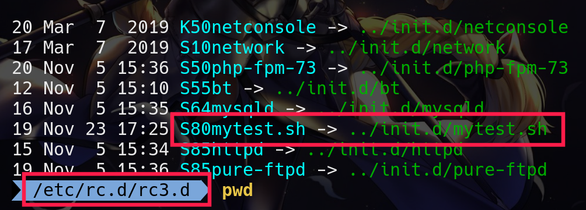

## make your service script

```sh
#!/bin/bash

case $1 in
    start)
        echo "service start..."
        ;;
    stop)
        echo "service stop..."
        ;;
        *)
        echo "please input start|stop"
esac
```
### move this script to `/etc/rc.d/init.d`

**at this momment you can `service mytest.sh start` but `chkconfig --list mytest.sh`**

## make your service script became standard rpm script

- **add following into your script**  

    `# chkconfig: 2345 90 20` // 2345 means startup your scrip on runlevel 2/3/4/5 and 90 20 means startup later, close earlier

    `# description: mytest script server daemon`

## by chkconfig to set your script startup on power on
 
- **following** 

    `$ chkconfig --add mytest.sh`

    `$ chkconfig --list mytest.sh`    

- **you will see your script at `etc/rc.d/rc2.d[rc3.d/rc4.d/rc5.d]`** 

 


